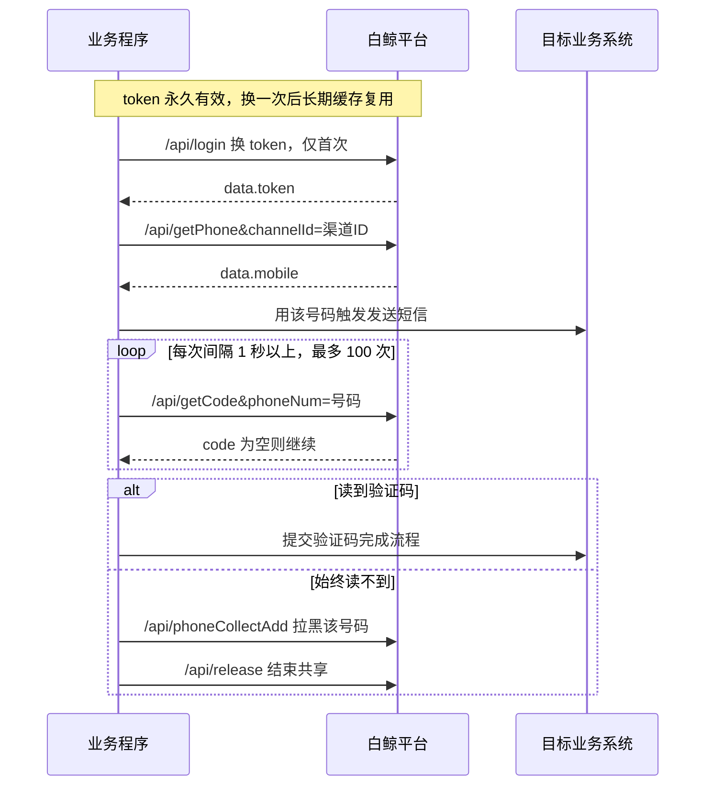

## 前言

白鲸数据共享平台（域名 `qc86.shop`）是另一类接码服务：它把「共享接收到的短信」按渠道组织起来，你用 `channelId` 指定渠道，就能取到临时号码并读取该号码收到的短信验证码。

和好芝麻那种「单入口 + `api=` 参数」的风格不同，白鲸是标准的 REST 风格路径，每个动作一个接口。它有两个必须提前知道的特性：**严格的调用频率限制**和**登录受 IP 白名单限制**。

- API 基础地址：`https://api.qc86.shop/api`
- 官方文档：`https://www.qc86.shop/docs`

> 本文只讲接口怎么调。文中出现的账号、密码、token、渠道 ID、手机号全部是占位符。

---

## 一、接口一览

| 接口 | 路径 | 用途 | 是否计费 |
|---|---|---|---|
| 登录 | `GET /api/login` | 用 API 凭据换 token | 否 |
| 查询余额 | `GET /api/getWallet` | 查账户余额 | 否 |
| 获取号码 | `GET /api/getPhone` | 取临时号码，一次最多 20 个 | 是 |
| 读取共享数据 | `GET /api/getCode` | 读一次短信验证码 | 是 |
| 拉黑号码 | `GET /api/phoneCollectAdd` | 该号码不再分配 | 是 |
| 结束共享 | `GET /api/release` | 释放该临时号码 | 是 |

### 成功判定和好芝麻不一样

白鲸要求 **HTTP 状态码 200，且响应体里 `success=true`、`status=200`** 才算成功：

```python
def check(data: dict, api: str) -> dict:
    if data.get("success") and str(data.get("status")) == "200":
        return data
    raise BaijingError(f"{api} 失败: {data.get('msg') or data}")
```

失败原因在 `msg` 字段里。

---

## 二、准备工作

### 1. 拿 API 凭据

在后台获取 **API Username** 与 **API Password**（官方文档里叫「API 认证凭证」）。这两个值只在**重新登录换 token** 时才用得到。

### 2. 拿渠道参数：channelId / sid / code

这是白鲸对接的第一步，也是最容易卡住的一步：

1. 进入后台的 **「接收数据」** 页面
2. 点击 **「获取API参数」**
3. 会得到一段 JSON，里面有 `channelId`、`sid`、`code` 三个值

这三个值随渠道切换而变化，原样保存即可。代码里可以直接解析这段 JSON：

```python
import json

def parse_api_params(text: str) -> dict:
    """解析后台「获取API参数」复制出来的 JSON。"""
    try:
        data = json.loads((text or "").strip())
    except Exception:
        return {}
    if not isinstance(data, dict):
        return {}
    return {k: str(data.get(k) or "").strip()
            for k in ("sid", "channelId", "code")
            if str(data.get(k) or "").strip()}
```

### 3. 处理 IP 白名单

**登录接口受 IP 白名单限制**：只有白名单内的 IP 才能用 API 凭据换 token。如果你在本地能登录、部署到服务器后报登录失败，先检查服务器公网 IP 有没有加进白名单。

好消息是 **token 永久有效**，重置 API 凭据之前一直可用。所以常见做法是：在能登录的机器上换一次 token，把 token 存到配置文件或环境变量里带到部署环境，后续就不再调登录接口了。

### 4. 凭据存放

```json
// baijing_config.json —— 记得加进 .gitignore
{
  "username": "你的 API Username",
  "password": "你的 API Password",
  "channelId": "你的渠道ID",
  "sid": "你的项目 sid",
  "code": "你的项目 code",
  "token": "登录后拿到的永久 token"
}
```

也可以用环境变量 `BJJ_USER` / `BJJ_PASS` 提供账号密码。

---

## 三、接口详解

### 1. 登录

```
GET https://api.qc86.shop/api/login?username=API用户名&password=API密码
```

| 参数 | 必选 | 类型 | 说明 |
|---|---|---|---|
| `username` | 是 | string | API Username |
| `password` | 是 | string | API Password |

返回：

```json
{
  "success": true,
  "status": 200,
  "data": {
    "token": "登录后拿到的永久令牌"
  }
}
```

拿到 token 后**请务必缓存**。token 永久有效，反复调用登录接口既浪费一次请求配额，也更容易触发风控。

### 2. 查询余额

```
GET https://api.qc86.shop/api/getWallet?token=<token>
```

| 参数 | 必选 | 类型 | 说明 |
|---|---|---|---|
| `token` | 是 | string | 令牌 |

余额在 `data.balances`。

### 3. 获取号码

```
GET https://api.qc86.shop/api/getPhone?token=<token>&channelId=<渠道ID>
```

| 参数 | 必选 | 类型 | 说明 |
|---|---|---|---|
| `token` | 是 | string | 令牌 |
| `channelId` | 是 | string | 渠道 ID |
| `phoneNum` | 否 | string | 指定号码 |
| `operator` | 否 | int | `0` 全部、`5` 虚拟、`4` 非虚拟 |
| `scope` | 否 | string | 只取号段，如 `138` |
| `scope_black` | 否 | string | 排除号段 |

**一次最多获取 20 个号码**，`num` 参数不要超过这个上限。

返回的号码在 `data.mobile`。

### 4. 读取共享数据（读码）

```
GET https://api.qc86.shop/api/getCode?token=<token>&channelId=<渠道ID>&phoneNum=号码
```

| 参数 | 必选 | 类型 | 说明 |
|---|---|---|---|
| `token` | 是 | string | 令牌 |
| `channelId` | 是 | string | 渠道 ID |
| `phoneNum` | 是 | string | 号码 |

返回里有两个可能带验证码的字段：

| 字段 | 说明 |
|---|---|
| `data.code` | 平台识别出的验证码 |
| `data.modle` | 短信正文 |

取码策略和好芝麻一致：优先用 `code`，为空时从 `modle` 正文正则提取 4-8 位数字：

```python
import re

def extract_code(resp: dict) -> str:
    data = resp.get("data") or {}
    code = str(data.get("code") or "").strip()
    if code:
        return code
    text = str(data.get("modle") or "")
    m = re.search(r"\b(\d{4,8})\b", text) or re.search(r"(\d{4,8})", text)
    return m.group(1) if m else ""
```

**轮询上限**：官方建议最多读 **100 次**，且每次之间间隔 1 秒以上。

### 5. 拉黑号码

```
GET https://api.qc86.shop/api/phoneCollectAdd?token=<token>&channelId=<渠道ID>&phoneNo=号码&type=0
```

| 参数 | 必选 | 类型 | 说明 |
|---|---|---|---|
| `token` | 是 | string | 令牌 |
| `channelId` | 是 | string | 渠道 ID |
| `phoneNo` | 是 | string | 号码 |
| `type` | 是 | int | 默认 `0` |

拉黑后该号码不会再分配给你，用于处理不来码的号码。

### 6. 结束共享

```
GET https://api.qc86.shop/api/release?token=<token>&channelId=<渠道ID>&phoneNo=号码&status=2
```

| 参数 | 必选 | 类型 | 说明 |
|---|---|---|---|
| `token` | 是 | string | 令牌 |
| `channelId` | 是 | string | 渠道 ID |
| `phoneNo` | 是 | string | 号码 |
| `status` | 是 | int | 默认 `2` |

### 频率限制：白鲸最容易踩的坑

官方文档明确要求：**每次调用之间需要休眠 1 秒以上，疯狂请求会封号。**

所以正确做法不是「加个 sleep 就完事」，而是把所有平台请求统一串行化并限速，保证无论业务侧并发多少，打到平台的请求间隔都不小于阈值：

```python
import threading
import time

_API_LOCK = threading.RLock()
MIN_INTERVAL = 1.2      # 官方要求 1s 以上，留点余量
_last_call = 0.0


def throttle() -> None:
    """调用前限速，调用方需持有 _API_LOCK。"""
    global _last_call
    wait = MIN_INTERVAL - (time.time() - _last_call)
    if wait > 0:
        time.sleep(wait)
    _last_call = time.time()
```

如果你的程序是多线程的，用模块级锁把「限速 + 发请求」包成一个原子操作，才能保证限速真正生效。

---

## 四、完整收码流程



---

## 五、curl 示例

```bash
# 1. 登录换 token
curl "https://api.qc86.shop/api/login?username=YOUR_API_USER&password=YOUR_API_PASS"

# 2. 查余额
curl "https://api.qc86.shop/api/getWallet?token=YOUR_TOKEN"

# 3. 取号（只要非虚拟号）
curl "https://api.qc86.shop/api/getPhone?token=YOUR_TOKEN&channelId=YOUR_CHANNEL_ID&operator=4"

# 4. 读码
curl "https://api.qc86.shop/api/getCode?token=YOUR_TOKEN&channelId=YOUR_CHANNEL_ID&phoneNum=13800000000"

# 5. 拉黑
curl "https://api.qc86.shop/api/phoneCollectAdd?token=YOUR_TOKEN&channelId=YOUR_CHANNEL_ID&phoneNo=13800000000&type=0"

# 6. 结束共享
curl "https://api.qc86.shop/api/release?token=YOUR_TOKEN&channelId=YOUR_CHANNEL_ID&phoneNo=13800000000&status=2"
```

注意上面每条命令之间应当**间隔 1 秒以上**，手动敲自然满足，写脚本时要显式限速。

---

## 六、Python 完整示例

```python
# -*- coding: utf-8 -*-
"""白鲸数据共享平台最小可用客户端。"""
import json
import os
import re
import threading
import time

import httpx

BASE_URL = "https://api.qc86.shop/api"
OPERATOR = {0: "全部", 5: "虚拟", 4: "非虚拟"}
RELEASE_STATUS = 2
COLLECT_TYPE = 0
MIN_INTERVAL = 1.2                      # 官方要求 1s 以上
CONFIG_FILE = "baijing_config.json"

_API_LOCK = threading.RLock()


class BaijingError(Exception):
    pass


class BaijingClient:
    def __init__(self, config_file: str = CONFIG_FILE, timeout: float = 20.0):
        self.config_file = config_file
        cfg = {}
        if os.path.exists(config_file):
            try:
                cfg = json.load(open(config_file, encoding="utf-8"))
            except Exception:
                cfg = {}
        self.username = (cfg.get("username") or os.environ.get("BJJ_USER") or "").strip()
        self.password = (cfg.get("password") or os.environ.get("BJJ_PASS") or "").strip()
        self.channel_id = str(cfg.get("channelId") or "").strip()
        self.sid = str(cfg.get("sid") or "").strip()
        self.project_code = str(cfg.get("code") or "").strip()
        self._token = (cfg.get("token") or "").strip()
        self._last_call = 0.0
        self.http = httpx.Client(timeout=timeout)

    # ---------- 底层 ----------
    def _throttle(self) -> None:
        """限速，调用方需持有 _API_LOCK。"""
        wait = MIN_INTERVAL - (time.time() - self._last_call)
        if wait > 0:
            time.sleep(wait)
        self._last_call = time.time()

    def _call(self, api: str, params: dict) -> dict:
        with _API_LOCK:
            self._throttle()
            try:
                r = self.http.get(f"{BASE_URL}/{api}", params=params,
                                  headers={"User-Agent": "baijing-client/1.0"})
                data = r.json()
            except Exception as e:
                raise BaijingError(f"请求失败({api}): {type(e).__name__}: {e}")
        if not isinstance(data, dict):
            raise BaijingError(f"返回异常({api}): {str(data)[:120]}")
        return data

    @staticmethod
    def _check(data: dict, api: str) -> dict:
        if data.get("success") and str(data.get("status")) == "200":
            return data
        raise BaijingError(f"{api} 失败: {data.get('msg') or data}")

    def _save_token(self, token: str) -> None:
        self._token = token
        with _API_LOCK:
            cfg = {}
            if os.path.exists(self.config_file):
                try:
                    cfg = json.load(open(self.config_file, encoding="utf-8"))
                except Exception:
                    cfg = {}
            cfg["token"] = token
            json.dump(cfg, open(self.config_file, "w", encoding="utf-8"),
                      ensure_ascii=False, indent=2)

    # ---------- 基础接口 ----------
    def login(self, force: bool = False) -> str:
        """token 永久有效：有缓存就直接用，force=True 才真正请求登录接口。"""
        with _API_LOCK:
            if self._token and not force:
                return self._token
            if not self.username or not self.password:
                raise BaijingError("缺少凭据：请配置 username/password 或设置 BJJ_USER/BJJ_PASS")
            data = self._call("login", {"username": self.username,
                                        "password": self.password})
            self._check(data, "登录")
            token = str((data.get("data") or {}).get("token") or "").strip()
            if not token:
                raise BaijingError(f"登录成功但未返回 token: {str(data)[:160]}")
            self._save_token(token)
            return token

    def get_wallet(self) -> dict:
        return self._check(self._call("getWallet", {"token": self.login()}), "查询余额")

    # ---------- 付费接口 ----------
    def _channel(self, channel_id: str | None = None) -> str:
        cid = str(channel_id or self.channel_id or "").strip()
        if not cid:
            raise BaijingError("缺少渠道ID：请在后台「接收数据」页点「获取API参数」获取 channelId")
        return cid

    def get_phone(self, channel_id: str | None = None, phone_num: str | None = None,
                  operator: int | None = None, scope: str | None = None,
                  scope_black: str | None = None) -> dict:
        """取临时号码，一次最多 20 个。"""
        p = {"token": self.login(), "channelId": self._channel(channel_id)}
        if phone_num:
            p["phoneNum"] = phone_num
        if operator:
            p["operator"] = operator        # 0全部 5虚拟 4非虚拟
        if scope:
            p["scope"] = scope
        if scope_black:
            p["scope_black"] = scope_black
        return self._check(self._call("getPhone", p), "取号")

    def get_code(self, phone: str, channel_id: str | None = None) -> dict:
        """读一次共享数据。"""
        return self._check(self._call("getCode", {"token": self.login(),
                                                  "channelId": self._channel(channel_id),
                                                  "phoneNum": phone}), "读取共享数据")

    def blacklist(self, phone: str, channel_id: str | None = None) -> dict:
        return self._check(self._call("phoneCollectAdd",
                                      {"token": self.login(),
                                       "channelId": self._channel(channel_id),
                                       "phoneNo": phone,
                                       "type": COLLECT_TYPE}), "拉黑号码")

    def release(self, phone: str, channel_id: str | None = None,
                status: int = RELEASE_STATUS) -> dict:
        return self._check(self._call("release",
                                      {"token": self.login(),
                                       "channelId": self._channel(channel_id),
                                       "phoneNo": phone,
                                       "status": status}), "结束共享")

    # ---------- 高层封装 ----------
    @staticmethod
    def extract_code(resp: dict) -> str:
        data = resp.get("data") or {}
        code = str(data.get("code") or "").strip()
        if code:
            return code
        text = str(data.get("modle") or "")
        m = re.search(r"\b(\d{4,8})\b", text) or re.search(r"(\d{4,8})", text)
        return m.group(1) if m else ""

    def wait_code(self, phone: str, channel_id: str | None = None,
                  timeout: float = 180.0, interval: float = 1.5) -> str | None:
        """轮询读码：最多 100 次，每次间隔 1 秒以上。"""
        deadline = time.time() + timeout
        attempt = 0
        while time.time() < deadline:
            attempt += 1
            try:
                resp = self.get_code(phone, channel_id)
            except BaijingError:
                resp = {}
            code = self.extract_code(resp)
            if code:
                return code
            if attempt >= 100 or time.time() >= deadline:
                break
            time.sleep(interval)
        return None


if __name__ == "__main__":
    c = BaijingClient()
    print("余额:", c.get_wallet().get("data"))
    info = c.get_phone(operator=4)              # 只要非虚拟号
    phone = str((info.get("data") or {}).get("mobile"))
    print("取号:", phone)
    print("读码:", c.wait_code(phone, timeout=60) or "（60 秒内未收到）")
```

依赖：`pip install httpx`。

---

## 七、常见错误与排查

| 现象 | 原因 | 处理 |
|---|---|---|
| 登录失败 | 本机公网 IP 不在白名单内 | 到后台把 IP 加进白名单，或改用已换好 token 的机器 |
| 提示调用过于频繁 / 账号被封 | 请求间隔小于 1 秒 | 把平台请求串行化并强制 1.2 秒以上间隔 |
| 取号返回失败 | `channelId` 缺失或错误 | 重新在「接收数据」页点「获取API参数」 |
| 读码一直为空 | 号码未收到短信，或渠道选错 | 换号重试；确认渠道与业务匹配 |
| 单次取号数量不足 | 超过一次 20 个的上限 | 拆成多次请求，注意每次间隔 1 秒 |
| 换环境后 token 失效 | 重置了 API 凭据 | 用新凭据重新登录换 token |

---

## 八、安全与合规提示

- **凭据与 token 不要进代码仓库**。API 凭据、永久 token、`channelId` 都属于敏感信息，走环境变量或本地配置文件，并把配置文件写进 `.gitignore`。
- **严守 1 秒限速**。这是平台写进文档的硬要求，超频会直接封号，封号后账号里的余额也会一起用不了。
- **用途要合法**。接码平台只应用于合法场景，例如接收你自己业务的短信、自有账号的自动化测试、隐私保护场景下的注册。不得用于绕过他人平台的服务条款、批量虚假注册、诈骗或任何违法用途。使用者需自行承担合规责任。

---

## 参考

- 白鲸官方文档：`https://www.qc86.shop/docs`
- API 基础地址：`https://api.qc86.shop/api`
