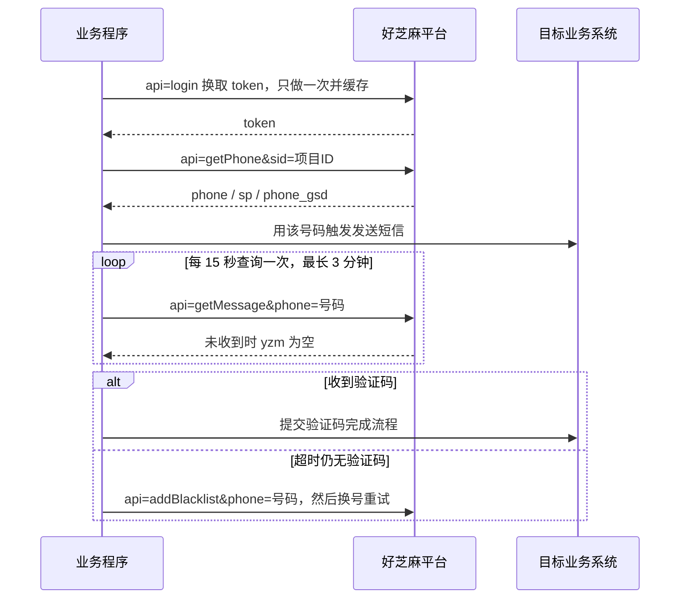

## 前言

好芝麻（haozhuma）是典型的「接码平台」：你按条付费，平台给你一个临时手机号，你把号码填进需要短信验证的流程，再通过 API 把收到的验证码读回来。

它的接口设计非常朴素——所有请求打到同一个入口，靠 `api=` 参数区分具体动作，返回统一是 JSON。整套对接代码不到两百行就能写完。

- 网页后台：`h5.haozhuma.com`、`h5.haozhuyun.com`
- API 文档：`https://www.showdoc.com.cn/haozhuma/11481322590171300`
- 服务器地址：`https://api.haozhuma.com`、`https://api.haozhuyun.com`

> 本文只讲接口怎么调。文中出现的账号、密码、token、手机号全部是占位符，实际使用时请从自己的后台获取。

---

## 一、接口一览

所有接口共用同一个入口：

```
GET/POST https://api.haozhuma.com/sms/?api=<接口名>&<参数...>
```

| 接口 | api 参数 | 用途 | 是否计费 |
|---|---|---|---|
| 登录 | `login` | 用 API 账号密码换 token | 否 |
| 查询余额 | `getSummary` | 查余额与最大区号数量 | 否 |
| 获取号码 | `getPhone` | 取一个新号码 | 是 |
| 指定号码 | `getPhone` + `phone=` | 占用旧号码，占用成功后才能读码 | 是 |
| 获取验证码 | `getMessage` | 读一次短信 | 是 |
| 释放号码 | `cancelRecv` | 释放单个号码 | 否 |
| 释放全部 | `cancelAllRecv` | 释放账号下全部号码 | 否 |
| 拉黑号码 | `addBlacklist` | 该号码不再分配给你 | 否 |

### 成功码不统一，这点必须先处理

平台各接口的成功码并不一致，判断时必须同时接受 `0` 和 `200`：

```python
def ok(code) -> bool:
    return str(code) in ("0", "200")
```

失败时 `code` 为 `-1`。忽略这一点很容易出现「实际成功了却当成失败」的问题——比如 `cancelAllRecv` 和 `addBlacklist` 返回的是 `200`，而 `login` 和 `getPhone` 返回的是 `0`。

---

## 二、准备工作

### 1. 拿 API 账号与密码

在网页后台（`h5.haozhuma.com`）里可以查看专门的 **API 账号** 与 **API 密码**，它和登录网页用的账号密码不是一回事，不要混用。

### 2. 确定项目 ID（sid）

`sid` 代表你要接收哪一类短信。确定方法很简单：**用你自己的手机去目标业务走一次流程，看收到的短信模板前缀**。

比如收到：

```
【4399】您的验证码是 123456，请勿泄露。
```

那么项目名就填 `4399`，在后台找到对应项目后拿到的数字就是 `sid`。

如果试了很多号码都收不到码，大概率是 `sid` 选错了项目，而不是号码问题。

### 3. 选择服务器线路

平台提供两条线路，哪条连通性好用哪条：

| 线路 | 地址 |
|---|---|
| 线路一 | `https://api.haozhuma.com` |
| 线路二 | `https://api.haozhuyun.com` |

生产代码里建议做成「主线路失败自动切备用线路」，而不是写死一条。平台自己也建议给用户留一个服务器地址输入框，以便日后线路变更时不用改代码。

### 4. 凭据存放

不要把账号密码写进代码或提交到 Git。推荐放环境变量或本地配置文件：

```bash
# 环境变量方式
export HZM_USER="你的API账号"
export HZM_PASS="你的API密码"
export HZM_SID="你的项目ID"
```

```json
// 或者本地配置文件 hzm_config.json，记得加进 .gitignore
{
  "user": "你的API账号",
  "pass": "你的API密码",
  "sid": "你的项目ID",
  "server": "https://api.haozhuma.com",
  "token": ""
}
```

---

## 三、接口详解

### 1. 登录：获取 token

```
GET https://api.haozhuma.com/sms/?api=login&user=API账号&pass=API密码
```

| 参数 | 必选 | 类型 | 说明 |
|---|---|---|---|
| `user` | 是 | string | API 账号 |
| `pass` | 是 | string | API 密码 |

返回：

```json
{
  "msg": "success",
  "code": 0,
  "token": "登录后拿到的令牌，固定值"
}
```

**关键点：token 是固定值。** 只要不修改密码，这个 token 永远不变。所以正确做法是登录一次、把 token 缓存起来（写进本地配置文件或内存），后续所有请求直接复用，**不要每取一次号就登录一次**。

### 2. 查询余额

```
GET https://api.haozhuma.com/sms/?api=getSummary&token=<token>
```

| 参数 | 必选 | 类型 | 说明 |
|---|---|---|---|
| `token` | 是 | string | 令牌 |

返回：

```json
{
  "msg": "success",
  "code": 0,
  "money": "36.00",
  "num": 50
}
```

| 字段 | 说明 |
|---|---|
| `money` | 账户余额 |
| `num` | 最大区号数量 |

跑批量任务前先查一次余额，余额不足时提前报错，比跑到一半才发现没钱体验好得多。

### 3. 获取号码

```
GET https://api.haozhuma.com/sms/?api=getPhone&token=<token>&sid=<项目ID>
```

| 参数 | 必选 | 类型 | 说明 |
|---|---|---|---|
| `token` | 是 | string | 令牌 |
| `sid` | 是 | int | 项目 ID |
| `isp` | 否 | int | 运营商，见下方代码表 |
| `Province` | 否 | string | 号码省份，如 `44` 代表广东 |
| `ascription` | 否 | int | 号码类型：`1` 只取虚拟，`2` 只取实卡，留空不限 |
| `paragraph` | 否 | int | 只取号段 |
| `exclude` | 否 | int | 排除号段 |
| `uid` | 否 | string | 只取该对接码下的号码 |
| `author` | 否 | string | 开发者账号，置入后获取消费分成 |

`paragraph` 与 `exclude` 支持多选，用 `|` 连接，例如 `1380|1580|1880`。

返回：

```json
{
  "code": "0",
  "msg": "成功",
  "sid": "1000",
  "country_name": "cn",
  "country_code": "cn",
  "country_qu": "+86",
  "uid": null,
  "phone": "13800000000",
  "sp": "移动",
  "phone_gsd": "广东"
}
```

| 字段 | 说明 |
|---|---|
| `phone` | 号码 |
| `sp` | 运营商 |
| `phone_gsd` | 号码归属地 |
| `country_qu` | 国家区号 |

### 4. 指定号码（复用旧号）

如果你手上已经有一个号码，想继续用它收码，不能直接调 `getMessage`——平台会提示「你没有权限读取该号码」。正确顺序是**先占用，再读码**：

```
GET https://api.haozhuma.com/sms/?api=getPhone&token=<token>&sid=<项目ID>&phone=号码
```

| 参数 | 必选 | 类型 | 说明 |
|---|---|---|---|
| `token` | 是 | string | 令牌 |
| `sid` | 是 | int | 项目 ID |
| `phone` | 是 | int | 要占用的号码 |
| `author` | 否 | string | 开发者账号 |

返回结构和新取号一致。看到 `code=0` 就说明占用成功，之后才能读码。

### 5. 获取验证码

```
GET https://api.haozhuma.com/sms/?api=getMessage&token=<token>&sid=<项目ID>&phone=号码
```

| 参数 | 必选 | 类型 | 说明 |
|---|---|---|---|
| `token` | 是 | string | 令牌 |
| `sid` | 是 | int | 项目 ID |
| `phone` | 是 | int | 号码 |

返回：

```json
{
  "code": "0",
  "msg": "成功",
  "sms": "【游戏】您正在申请手机注册，验证码为：5184，1440分钟内有效！",
  "yzm": "5184"
}
```

| 字段 | 说明 |
|---|---|
| `sms` | 完整短信内容 |
| `yzm` | 平台识别出的数字验证码 |

**取码策略**：优先用 `yzm`；如果平台没识别出来（`yzm` 为空），再从 `sms` 正文里正则提取 4-8 位数字兜底：

```python
import re

def extract_yzm(resp: dict) -> str:
    yzm = str(resp.get("yzm") or "").strip()
    if yzm:
        return yzm
    sms = resp.get("sms") or ""
    m = re.search(r"\b(\d{4,8})\b", sms) or re.search(r"(\d{4,8})", sms)
    return m.group(1) if m else ""
```

**轮询节奏**：官方建议 **每 15 秒查一次**，不要高频轰炸。

### 6. 释放号码

```
GET https://api.haozhuma.com/sms/?api=cancelRecv&token=<token>&sid=<项目ID>&phone=号码
```

释放全部号码（不需要 `sid` 和 `phone`）：

```
GET https://api.haozhuma.com/sms/?api=cancelAllRecv&token=<token>
```

注意：`cancelRecv` 只是「交还」号码，**下次取号它还可能再分配给你**。如果这个号码是你不想再见到的，要用下面的拉黑接口。

### 7. 拉黑号码

```
GET https://api.haozhuma.com/sms/?api=addBlacklist&token=<token>&sid=<项目ID>&phone=号码
```

| 参数 | 必选 | 类型 | 说明 |
|---|---|---|---|
| `token` | 是 | string | 令牌 |
| `sid` | 是 | int | 项目 ID |
| `phone` | 是 | int | 号码 |

被拉黑的号码不会再分配给你。**这是处理「不来码」号码的正确姿势**：官方文档明确建议，超过 3 分钟没收到验证码的号码可能欠费，应当拉黑，避免反复抽到它拖慢效率。

### 运营商参数代码表

`isp` 参数只支持下列「可用」项：

| 运营商 | isp 值 |
|---|---|
| 中国移动 | `1` |
| 中国联通 | `5` |
| 中国电信 | `9` |
| 中国广电 | `14` |
| 虚拟运营商 | `16` |

（表中未列出的值如 `2`、`3`、`4` 等已标记为不可用，不要使用。）

`Province` 省份代码另有独立代码表，例如 `44` 代表广东，完整表格见平台文档。

---

## 四、完整收码流程



一句话总结流程：**登录拿 token → 取号 → 触发业务短信 → 每 15 秒读码 → 3 分钟无码就拉黑换号**。

另外官方还有一个很实用的建议：**第一次对接时先手动去网页或客户端操作一遍**，确认这个项目确实能收到码，再写自动化代码，能省掉大量「到底是我代码错了还是这个项目本身不来码」的排查时间。

---

## 五、curl 示例

```bash
# 1. 登录拿 token
curl "https://api.haozhuma.com/sms/?api=login&user=YOUR_API_USER&pass=YOUR_API_PASS"

# 2. 查余额
curl "https://api.haozhuma.com/sms/?api=getSummary&token=YOUR_TOKEN"

# 3. 取号（限定中国移动）
curl "https://api.haozhuma.com/sms/?api=getPhone&token=YOUR_TOKEN&sid=YOUR_SID&isp=1"

# 4. 读码
curl "https://api.haozhuma.com/sms/?api=getMessage&token=YOUR_TOKEN&sid=YOUR_SID&phone=13800000000"

# 5. 不来码就拉黑
curl "https://api.haozhuma.com/sms/?api=addBlacklist&token=YOUR_TOKEN&sid=YOUR_SID&phone=13800000000"
```

---

## 六、Python 完整示例

下面是一个可直接运行的客户端，包含 token 缓存、备用线路切换、轮询读码与拉黑换号：

```python
# -*- coding: utf-8 -*-
"""好芝麻接码平台最小可用客户端。"""
import json
import os
import re
import time

import httpx

SERVERS = ["https://api.haozhuma.com", "https://api.haozhuyun.com"]
ISP = {1: "移动", 5: "联通", 9: "电信", 14: "广电", 16: "虚商"}
CONFIG_FILE = "hzm_config.json"


class HzmError(Exception):
    pass


class HzmClient:
    def __init__(self, config_file: str = CONFIG_FILE, timeout: float = 20.0):
        self.config_file = config_file
        cfg = {}
        if os.path.exists(config_file):
            try:
                cfg = json.load(open(config_file, encoding="utf-8"))
            except Exception:
                cfg = {}
        self.user = (cfg.get("user") or os.environ.get("HZM_USER") or "").strip()
        self.password = (cfg.get("pass") or os.environ.get("HZM_PASS") or "").strip()
        self.sid = str(cfg.get("sid") or os.environ.get("HZM_SID") or "").strip()
        self.server = (cfg.get("server") or SERVERS[0]).rstrip("/")
        self._token = (cfg.get("token") or "").strip()
        self.http = httpx.Client(timeout=timeout)

    # ---------- 底层 ----------
    @staticmethod
    def _ok(code) -> bool:
        # 各接口成功码不统一，0 和 200 都算成功
        return str(code) in ("0", "200")

    def _save_token(self, token: str) -> None:
        self._token = token
        cfg = {}
        if os.path.exists(self.config_file):
            try:
                cfg = json.load(open(self.config_file, encoding="utf-8"))
            except Exception:
                cfg = {}
        cfg["token"] = token
        json.dump(cfg, open(self.config_file, "w", encoding="utf-8"),
                  ensure_ascii=False, indent=2)

    def _call(self, api: str, params: dict) -> dict:
        params = {"api": api, **params}
        last_err = None
        # 主线路失败自动切备用线路
        for base in [self.server] + [s for s in SERVERS if s.rstrip("/") != self.server]:
            try:
                r = self.http.get(base + "/sms/", params=params,
                                  headers={"User-Agent": "hzm-client/1.0"})
                data = r.json()
                self.server = base.rstrip("/")
                return data
            except Exception as e:
                last_err = e
        raise HzmError(f"请求失败({api}): {last_err}")

    # ---------- 基础接口 ----------
    def login(self, force: bool = False) -> str:
        """token 是固定值，缓存复用，不要每次取号都登录。"""
        if self._token and not force:
            return self._token
        if not self.user or not self.password:
            raise HzmError("缺少凭据：请配置 user/pass 或设置 HZM_USER/HZM_PASS")
        r = self._call("login", {"user": self.user, "pass": self.password})
        if not self._ok(r.get("code")):
            raise HzmError(f"登录失败: {r.get('msg')}")
        self._save_token(r["token"])
        return self._token

    def get_summary(self) -> dict:
        r = self._call("getSummary", {"token": self.login()})
        if not self._ok(r.get("code")):
            raise HzmError(f"查询余额失败: {r.get('msg')}")
        return r

    def get_phone(self, isp: int | None = None, exclude: str | None = None) -> dict:
        p = {"token": self.login(), "sid": self.sid}
        if isp:
            p["isp"] = isp
        if exclude:
            p["exclude"] = exclude          # 多号段用 | 连接，如 "1380|1580"
        r = self._call("getPhone", p)
        if not self._ok(r.get("code")):
            raise HzmError(f"取号失败: {r.get('msg')}")
        return r

    def occupy(self, phone: str) -> dict:
        """复用旧号：必须先占用，否则读码会提示没有权限。"""
        r = self._call("getPhone",
                       {"token": self.login(), "sid": self.sid, "phone": phone})
        if not self._ok(r.get("code")):
            raise HzmError(f"占用号码 {phone} 失败: {r.get('msg')}")
        return r

    def get_message(self, phone: str) -> dict | None:
        r = self._call("getMessage",
                       {"token": self.login(), "sid": self.sid, "phone": phone})
        return r if self._ok(r.get("code")) else None

    def release(self, phone: str) -> None:
        """释放：下次取号还可能再出现。"""
        self._call("cancelRecv",
                   {"token": self.login(), "sid": self.sid, "phone": phone})

    def release_all(self) -> None:
        self._call("cancelAllRecv", {"token": self.login()})

    def blacklist(self, phone: str) -> None:
        """拉黑：该号码不再分配。"""
        self._call("addBlacklist",
                   {"token": self.login(), "sid": self.sid, "phone": phone})

    # ---------- 高层封装 ----------
    @staticmethod
    def extract_yzm(resp: dict) -> str:
        yzm = str(resp.get("yzm") or "").strip()
        if yzm:
            return yzm
        sms = resp.get("sms") or ""
        m = re.search(r"\b(\d{4,8})\b", sms) or re.search(r"(\d{4,8})", sms)
        return m.group(1) if m else ""

    def wait_code(self, phone: str, timeout: float = 180.0,
                  interval: float = 15.0) -> str | None:
        """每 15 秒读一次，最长 3 分钟。"""
        deadline = time.time() + timeout
        while time.time() < deadline:
            resp = self.get_message(phone)
            yzm = self.extract_yzm(resp) if resp else ""
            if yzm:
                return yzm
            remain = deadline - time.time()
            if remain <= 0:
                break
            time.sleep(min(interval, remain))
        return None

    def auto_get_code(self, send_fn, max_numbers: int = 5,
                      code_timeout: float = 180.0, log=print):
        """取号 -> 触发业务短信 -> 收码；超时则拉黑换号。"""
        self.login()
        for i in range(1, max_numbers + 1):
            info = self.get_phone()
            phone = str(info["phone"])
            log(f"[{i}/{max_numbers}] 取号: {phone}（{info.get('sp')} {info.get('phone_gsd')}）")

            if not send_fn(phone):          # send_fn 由调用方实现：触发业务发短信
                log(f"发送失败，释放 {phone} 换号")
                self.release(phone)
                continue

            yzm = self.wait_code(phone, timeout=code_timeout)
            if yzm:
                return phone, yzm

            log(f"{code_timeout:.0f}s 无验证码，拉黑 {phone} 换号")
            self.blacklist(phone)
        raise HzmError(f"连续 {max_numbers} 个号码都没收到验证码，请检查 sid 是否正确")


if __name__ == "__main__":
    c = HzmClient()
    print("余额:", c.get_summary().get("money"))
    info = c.get_phone()
    print("测试取号:", info.get("phone"), info.get("sp"), info.get("phone_gsd"))
    c.release(info["phone"])
    print("已释放")
```

依赖：`pip install httpx`。

---

## 七、常见错误与排查

| 现象 | 原因 | 处理 |
|---|---|---|
| 登录返回 `code=-1` | 账号密码错误，或把网页账号当成了 API 账号 | 在后台确认 API 账号与 API 密码 |
| 取号返回失败 | `sid` 错误、余额不足、号池暂时无号 | 先 `getSummary` 查余额，再核对 `sid` |
| 读码提示没有权限 | 号码未占用 | 先用 `getPhone&phone=` 占用 |
| 大量号码收不到码 | `sid` 选错项目 | 用自己手机看短信模板前缀，重新选项目 |
| 请求偶发失败 | 当前线路连通性差 | 自动切到备用线路 `api.haozhuyun.com` |
| 反复抽到同一个不来码的号码 | 用了 `cancelRecv` 而非 `addBlacklist` | 改用拉黑接口 |

---

## 八、安全与合规提示

- **凭据不要进代码仓库**。API 账号密码、token 一律走环境变量或本地配置文件，并把配置文件写进 `.gitignore`。token 等同于账号权限，泄露后别人可以直接消耗你的余额。
- **注意调用频率**。平台对同一账号有频率限制，轮询读码保持 15 秒间隔，不要并发轰炸。
- **用途要合法**。接码平台只应用于合法场景，例如接收你自己业务的短信、自有账号的自动化测试、隐私保护场景下的注册。不得用于绕过他人平台的服务条款、批量虚假注册、诈骗或任何违法用途。使用者需自行承担合规责任。

---

## 参考

- 好芝麻 API 文档：`https://www.showdoc.com.cn/haozhuma/11481322590171300`
- 后台地址：`h5.haozhuma.com`、`h5.haozhuyun.com`
