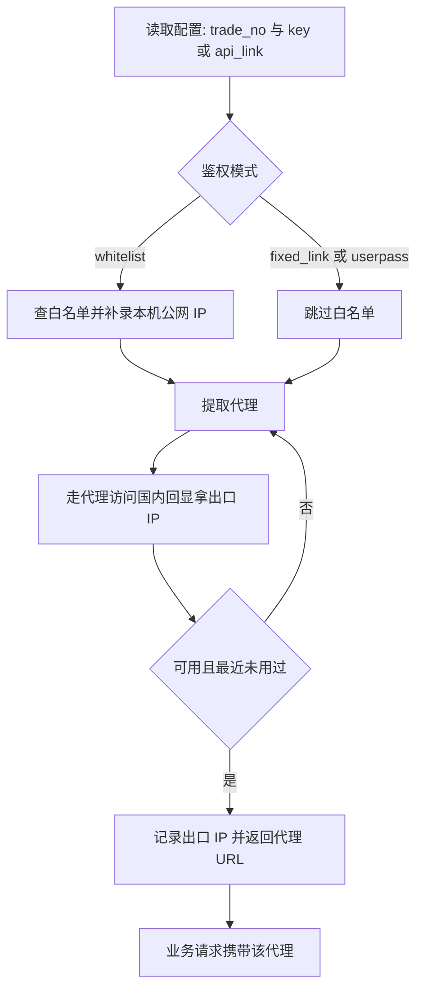

## 前言

巨量HTTP（`juliangip.com`）是国内常见的 HTTP 代理 IP 服务商，按提取量或时长计费。它的 API 有一个和其他同类平台不太一样的地方：**请求需要签名**。

签名本身不复杂，但参数排序规则有个容易踩的坑，很多人第一次对接会卡在 `code=401` 上。

- 官网：`https://www.juliangip.com`
- 文档：`https://www.juliangip.com/help/api/company/postpay/`、`https://www.juliangip.com/help/api/sign/`

> 本文只讲接口怎么调。文中出现的业务编号、API 密钥、代理地址全部是占位符。

---

## 一、先选接入方式：两种

巨量HTTP 提供两种用法，先想清楚用哪种，能省掉一半工作。

### 方式一：后台生成的固定提取链接（推荐）

在后台点「生成API链接」，会得到一个带 `trade_no` 和 `sign` 的完整 URL，例如：

```
http://v2.api.juliangip.com/company/postpay/getips?auth_type=2&auto_white=1&num=1&pt=1&result_type=text&split=1&trade_no=你的业务编号&sign=后台生成的签名
```

这个链接的特点是：

- **签名已经算好并写死在链接里**，你的代码不需要实现签名算法
- 链接里的参数可以自己改（`num`、`pt` 等），但改了参数签名理论上就不匹配了——所以**要用哪种参数组合，就在后台按那种组合生成链接**
- 配 `auth_type=2` 时，每次提取返回的是**动态账密**，不依赖 IP 白名单，海外主机、云主机都能用

代码里只需要 `GET` 这个链接、解析返回文本，简单可靠。

### 方式二：直接调 API，自己算签名

自己拼参数、自己算 `sign`，灵活度最高，适合参数需要动态变化的场景。

```
http://v2.api.juliangip.com/postpay/getips?trade_no=你的业务编号&num=1&pt=1&filter=1&result_type=json&split=1&sign=自己算出的签名
```

---

## 二、签名规则详解

这是巨量HTTP 对接的核心。规则只有三步：

### 第 1 步：所有请求参数按参数名 ASCII 升序排序

**注意是按参数名的 ASCII 码升序，不是按字母表顺序，也不是按数值大小。**

ASCII 排序意味着带数字的参数名有反直觉的顺序。文档里特意举了个例子：`InstanceIds.2` 要排在 `InstanceIds.12` 后面——因为逐字符比较时 `2` 的 ASCII 码大于 `1`。

### 第 2 步：拼成 `k1=v1&k2=v2...`

- 空值参数跳过，不参与拼接
- 参数名和参数值之间用 `=`，参数之间用 `&`
- 排序只针对参数名，参数值保持对应即可

### 第 3 步：末尾拼接 `&key=<API密钥>`，取 MD5

```
签名原文 = k1=v1&k2=v2&...&kn=vn&key=<API密钥>
sign     = MD5(签名原文)        # 32 位小写
```

举个完整例子。假设参数是：

| 参数名 | 值 |
|---|---|
| `trade_no` | `你的业务编号` |
| `num` | `10` |
| `result_type` | `json` |
| `city_name` | `1` |
| `key` | `YOUR_API_KEY` |

按 ASCII 升序排列后的顺序是 `city_name` → `num` → `result_type` → `trade_no`，签名原文就是：

```
city_name=1&num=10&result_type=json&trade_no=你的业务编号&key=YOUR_API_KEY
```

对这个字符串取 MD5，得到 32 位小写签名，即为 `sign`。

用 Python 实现：

```python
import hashlib


def sign(params: dict, key: str) -> str:
    """巨量HTTP 签名：参数名 ASCII 升序 -> k=v 用 & 连接 -> 末尾拼 &key=密钥 -> MD5。"""
    raw = "&".join(f"{k}={v}" for k, v in sorted(params.items())) + f"&key={key}"
    return hashlib.md5(raw.encode("utf-8")).hexdigest()
```

`sorted()` 对字符串默认就是按字符编码升序，正好符合要求。**签名时不要把 `sign` 参数本身算进去**，否则会算出一个错的签名。

---

## 三、三种鉴权模式

提取到的代理要能用，鉴权必须对上。巨量HTTP 支持三种模式：

| 模式 | 说明 | 需要配置 | 适用场景 |
|---|---|---|---|
| `fixed_link` | 后台生成的固定提取链接，`auth_type=2` 每次返回 `ip:port:用户:密码` 动态账密，免白名单 | `api_link` | **推荐**，海外/云主机可用 |
| `userpass` | 固定账密鉴权 | `trade_no` + `key` + `username` / `password` | 订单已开启账密鉴权 |
| `whitelist` | IP 白名单，只有白名单内的 IP 能用 | `trade_no` + `key`，需先调接口补录本机 IP | 仅大陆 IP 的机器 |

三种模式的区别直接决定了你的代码要不要写「查白名单 / 补录白名单」这段逻辑。**如果你在海外服务器或云主机上跑，用 `fixed_link` 或 `userpass`，不要用 `whitelist`。**

---

## 四、接口一览

接口按产品类型分路径，后台「生成API链接」会直接告诉你订单对应的完整路径。

| 接口 | 路径 | 用途 |
|---|---|---|
| 提取代理（按量付费） | `GET /postpay/getips` | 提取代理 IP |
| 提取代理（动态） | `GET /dynamic/getips` | 提取短效动态 IP |
| 查询白名单 | `GET /postpay/getwhiteip` | 查当前白名单与剩余名额 |
| 设置白名单 | `GET /postpay/setwhiteip` | 添加白名单 IP |
| 删除白名单 | `GET /postpay/delWhiteIp` | 删除白名单 IP |

统一基础地址：`http://v2.api.juliangip.com`

### 提取接口参数

| 参数 | 必选 | 说明 |
|---|---|---|
| `trade_no` | 是 | 业务编号 |
| `sign` | 是 | 签名 |
| `num` | 否 | 提取数量 |
| `pt` | 否 | 代理协议：`1` HTTP、`2` SOCKS |
| `filter` | 否 | `1` 表示过滤掉当天已提取过的 IP |
| `auto_white` | 否 | `1` 表示自动把本机公网 IP 加入订单白名单 |
| `result_type` | 否 | 返回格式：`json` / `text` |
| `split` | 否 | `1` 表示分隔返回 |

返回（`result_type=json`）：

```json
{
  "code": 200,
  "msg": "成功",
  "data": {
    "proxy_list": ["1.2.3.4:5678", "5.6.7.8:5678"]
  }
}
```

`code` 为 `200` 才算成功，失败原因看 `msg`。

### 白名单接口

**查询白名单**：

```
GET http://v2.api.juliangip.com/postpay/getwhiteip?trade_no=...&sign=...
```

返回：

```json
{
  "code": 200,
  "data": {
    "white_ip_count": 5,
    "surplus_white_ip_quantity": 3,
    "current_white_ip": ["1.2.3.4"]
  }
}
```

**设置白名单**（多个 IP 用逗号分隔，**限频 1 次/秒**）：

```
GET http://v2.api.juliangip.com/postpay/setwhiteip?trade_no=...&ips=1.2.3.4,5.6.7.8&sign=...
```

### 为什么 whitelist 模式要「先查再补录」

白名单不对的时候，代理请求会返回 **407**。所以正确做法是提取前先确认本机公网 IP 在不在白名单里，不在就补录：

```python
def ensure_whitelist(self) -> str:
    my_ip = self.public_ip()                    # 查本机公网 IP
    info = self.get_whiteips()
    current = [str(x) for x in (info.get("current_white_ip") or [])]
    if my_ip not in current:
        if int(info.get("surplus_white_ip_quantity", 0)) <= 0:
            raise JuliangError(f"白名单名额已满，且本机 IP {my_ip} 不在其中，请先清理")
        info = self.set_whiteips([my_ip])
        if my_ip not in [str(x) for x in (info.get("current_white_ip") or [])]:
            raise JuliangError("白名单设置后仍未生效")
    return my_ip
```

云主机和拨号网络的公网 IP 会变，把这段做成「每次提取前校验一次」比「配置时手动加一次」省心得多。

---

## 五、返回格式与代理 URL 拼接

不同鉴权模式返回的格式不同：

| 情况 | 返回格式 | 拼成的代理 URL |
|---|---|---|
| 只有 IP 和端口 | `1.2.3.4:5678` | `http://1.2.3.4:5678` |
| `auth_type=2` 动态账密 | `1.2.3.4:5678:用户名:密码` | `http://用户名:密码@1.2.3.4:5678` |

解析函数：

```python
def parse_entry(entry: str) -> str:
    """ip:port:user:pass -> 带账密的代理 URL；其余原样包 http://。"""
    entry = entry.strip()
    if "://" in entry:
        return entry
    parts = entry.split(":")
    if len(parts) == 4:
        ip, port, user, pwd = parts
        return f"http://{user}:{pwd}@{ip}:{port}"
    return f"http://{entry}"
```

---

## 六、验证代理是否真的可用

提取成功不等于代理能用。必须走一次代理请求，确认能连通并拿到出口 IP：

```python
import httpx

CHECK_URL = "https://ip.3322.net"


def check(proxy: str, test_url: str = CHECK_URL,
          timeout: float = 15.0) -> tuple[bool, str | None]:
    try:
        with httpx.Client(proxy=proxy, timeout=timeout) as c:
            r = c.get(test_url, headers={"User-Agent": "Mozilla/5.0"})
            r.raise_for_status()
            return True, r.text.strip()[:64]
    except Exception as e:
        return False, f"{type(e).__name__}: {e}"
```

**为什么用 `ip.3322.net` 而不是 `api.ipify.org`？** 因为 `ipify` 是海外服务，走国内住宅代理出口访问时经常超时或返回 5xx，会让你误判「代理不可用」。`ip.3322.net` 是纯文本的国内回显服务，连通性和返回速度都更稳，而且它返回的 IP 就是巨量HTTP 服务器看到的出口 IP，做白名单校验时更准。

实践数据显示，动态节点大约四分之三可用，所以「提取 → 验证 → 不可用就换下一个」这个循环是必须的。

---

## 七、出口 IP 去重：一个容易忽略的细节

`filter=1` 只能过滤「当天已经提取过」的 IP，而且**固定提取链接本身不带这个过滤**。这意味着你很可能会反复拿到同一个出口 IP。

问题在于：如果某个出口 IP 因为之前的操作被目标站点标记过，你再次复用它，很可能一上来就被判定为风险流量。所以除了平台侧的 `filter`，本地也应该记一份「最近用过的出口 IP」并主动避开：

```python
import json
import os
import time

HISTORY_FILE = "used_exits.json"
FRESH_HOURS = 24.0


def load_history() -> dict:
    if os.path.exists(HISTORY_FILE):
        try:
            return json.load(open(HISTORY_FILE, encoding="utf-8"))
        except Exception:
            pass
    return {}


def recent_exits() -> set:
    """最近 24 小时内用过的出口 IP。"""
    cutoff = time.time() - FRESH_HOURS * 3600
    return {ip for ip, ts in load_history().items() if ts >= cutoff}


def mark_exit(exit_ip: str) -> None:
    hist = load_history()
    hist[exit_ip] = time.time()
    cutoff = time.time() - FRESH_HOURS * 3600
    hist = {ip: ts for ip, ts in hist.items() if ts >= cutoff}
    json.dump(hist, open(HISTORY_FILE, "w", encoding="utf-8"),
              ensure_ascii=False, indent=2)
```

把「提取 → 验证 → 记账」整段做成一个带锁的原子操作，并发场景下才能保证不同任务拿到的出口 IP 互不相同：

```python
def get_fresh_proxy(client, max_tries: int = 6, log=print):
    """提取一个出口最近未用过的可用代理，返回 (代理URL, 出口IP)。"""
    seen = set()
    for i in range(1, max_tries + 1):
        proxy = client.get_proxy()
        ok, info = client.check(proxy)
        if not ok:
            log(f"出口不可用（{info}），重新提取 ...")
            continue
        exit_ip = str(info).strip()
        if exit_ip in recent_exits() or exit_ip in seen:
            log(f"出口 {exit_ip} 最近用过（第 {i} 次），避开重取 ...")
            seen.add(exit_ip)
            continue
        mark_exit(exit_ip)
        return proxy, exit_ip
    raise RuntimeError(f"连续 {max_tries} 次未取到未用过的出口 IP")
```

---

## 八、完整流程



---

## 九、curl 示例

```bash
# 方式一：直接用后台生成的固定提取链接（签名已内置）
curl "http://v2.api.juliangip.com/company/postpay/getips?auth_type=2&auto_white=1&num=1&pt=1&result_type=text&split=1&trade_no=你的业务编号&sign=后台生成的签名"

# 方式二：自己算签名后调 API（sign 用上文 Python 函数算出来）
curl "http://v2.api.juliangip.com/postpay/getips?trade_no=你的业务编号&num=1&pt=1&filter=1&result_type=json&split=1&sign=自己算出的签名"

# 查白名单
curl "http://v2.api.juliangip.com/postpay/getwhiteip?trade_no=你的业务编号&sign=自己算出的签名"

# 添加白名单（限频 1 次/秒）
curl "http://v2.api.juliangip.com/postpay/setwhiteip?trade_no=你的业务编号&ips=1.2.3.4&sign=自己算出的签名"

# 验证代理出口
curl -x "http://用户名:密码@1.2.3.4:5678" "https://ip.3322.net"
```

---

## 十、Python 完整示例

```python
# -*- coding: utf-8 -*-
"""巨量HTTP 按量付费代理最小可用客户端。"""
import hashlib
import json
import os
import time

import httpx

ENDPOINT = "http://v2.api.juliangip.com/postpay/getips"
API_BASE = "http://v2.api.juliangip.com/postpay"
IP_ECHO_URLS = [
    "https://ip.3322.net",
    "https://api.ipify.org/?format=json",
    "http://members.3322.org/dyndns/getip",
]
CONFIG_FILE = "juliangip_config.json"
HISTORY_FILE = "used_exits.json"
FRESH_HOURS = 24.0


class JuliangError(Exception):
    pass


class JuliangClient:
    def __init__(self, config_file: str = CONFIG_FILE, timeout: float = 20.0):
        self.config_file = config_file
        cfg = {}
        if os.path.exists(config_file):
            try:
                cfg = json.load(open(config_file, encoding="utf-8"))
            except Exception:
                cfg = {}
        self.trade_no = str(cfg.get("trade_no") or os.environ.get("JLIP_TRADE_NO") or "").strip()
        self.key = str(cfg.get("key") or os.environ.get("JLIP_KEY") or "").strip()
        # fixed_link / userpass / whitelist
        self.auth_mode = cfg.get("auth_mode") or "fixed_link"
        self.api_link = (cfg.get("api_link") or "").strip()
        self.pt = int(cfg.get("pt", 1))              # 1=HTTP 2=SOCKS
        self.filter = int(cfg.get("filter", 1))      # 1=过滤当天已提取
        self.auto_white = int(cfg.get("auto_white", 1))
        self.http = httpx.Client(timeout=timeout)

    # ---------- 签名 ----------
    @staticmethod
    def sign(params: dict, key: str) -> str:
        raw = "&".join(f"{k}={v}" for k, v in sorted(params.items())) + f"&key={key}"
        return hashlib.md5(raw.encode("utf-8")).hexdigest()

    def _api_get(self, api: str, params: dict) -> dict:
        params = {"trade_no": self.trade_no, **params}
        params["sign"] = self.sign(params, self.key)
        try:
            r = self.http.get(f"{API_BASE}/{api}", params=params)
        except Exception as e:
            raise JuliangError(f"{api} 请求失败: {type(e).__name__}: {e}")
        try:
            data = r.json()
        except Exception:
            raise JuliangError(f"{api} 返回非 JSON: {r.text[:200]}")
        if data.get("code") != 200:
            raise JuliangError(f"{api} 失败: {data.get('msg')} (code={data.get('code')})")
        return data.get("data") or {}

    # ---------- 公网 IP 与白名单 ----------
    def public_ip(self, timeout: float = 10.0) -> str:
        """多回显源依次尝试，避免单一海外源不可达导致误判。"""
        last_err = None
        for url in IP_ECHO_URLS:
            try:
                r = self.http.get(url, timeout=timeout)
                txt = r.text.strip()
                if "format=json" in url:
                    txt = str((r.json() or {}).get("ip") or "").strip()
                if txt:
                    return txt.split()[0]
            except Exception as e:
                last_err = e
        raise JuliangError(f"查询本机公网 IP 失败: {last_err}")

    def get_whiteips(self) -> dict:
        return self._api_get("getwhiteip", {})

    def set_whiteips(self, ips: list) -> dict:
        return self._api_get("setwhiteip", {"ips": ",".join(ips)})

    def ensure_whitelist(self) -> str:
        my_ip = self.public_ip()
        info = self.get_whiteips()
        current = [str(x) for x in (info.get("current_white_ip") or [])]
        if my_ip not in current:
            if int(info.get("surplus_white_ip_quantity", 0)) <= 0:
                raise JuliangError(f"白名单名额已满，且本机 IP {my_ip} 不在其中，请先清理")
            self.set_whiteips([my_ip])
        return my_ip

    # ---------- 提取 ----------
    @staticmethod
    def parse_entry(entry: str) -> str:
        entry = entry.strip()
        if "://" in entry:
            return entry
        parts = entry.split(":")
        if len(parts) == 4:                          # ip:port:user:pass
            ip, port, user, pwd = parts
            return f"http://{user}:{pwd}@{ip}:{port}"
        return f"http://{entry}"

    def get_proxy(self, num: int = 1) -> str:
        if self.auth_mode == "whitelist":
            self.ensure_whitelist()

        # 固定提取链接：签名已内置，直接 GET
        if self.api_link and self.auth_mode == "fixed_link":
            r = self.http.get(self.api_link, timeout=20)
            txt = r.text.strip()
            if txt.startswith("{"):
                data = json.loads(txt)
                if data.get("code") != 200:
                    raise JuliangError(f"提取失败: {data.get('msg')}")
                entries = list((data.get("data") or {}).get("proxy_list") or [])
            else:
                if txt.upper().startswith("ERROR"):
                    raise JuliangError(f"提取失败: {txt[:200]}")
                entries = [l.strip() for l in txt.splitlines() if l.strip()]
            if not entries:
                raise JuliangError("提取返回为空")
            return self.parse_entry(entries[0])

        # 自己拼参数 + 签名
        params = {
            "auto_white": self.auto_white,
            "filter": self.filter,
            "num": num,
            "pt": self.pt,
            "result_type": "json",
            "split": "1",
            "trade_no": self.trade_no,
        }
        params["sign"] = self.sign(params, self.key)
        r = self.http.get(ENDPOINT, params=params)
        data = r.json()
        if data.get("code") != 200:
            raise JuliangError(f"提取失败: {data.get('msg')} (code={data.get('code')})")
        entries = list((data.get("data") or {}).get("proxy_list") or [])
        if not entries:
            raise JuliangError("提取成功但列表为空")
        return self.parse_entry(entries[0])

    # ---------- 验证 ----------
    @staticmethod
    def check(proxy: str, test_url: str = IP_ECHO_URLS[0],
              timeout: float = 15.0) -> tuple:
        try:
            with httpx.Client(proxy=proxy, timeout=timeout) as c:
                r = c.get(test_url, headers={"User-Agent": "Mozilla/5.0"})
                r.raise_for_status()
                return True, r.text.strip()[:64]
        except Exception as e:
            return False, f"{type(e).__name__}: {e}"

    # ---------- 出口去重 ----------
    def _load_history(self) -> dict:
        if os.path.exists(HISTORY_FILE):
            try:
                return json.load(open(HISTORY_FILE, encoding="utf-8"))
            except Exception:
                pass
        return {}

    def recent_exits(self) -> set:
        cutoff = time.time() - FRESH_HOURS * 3600
        return {ip for ip, ts in self._load_history().items() if ts >= cutoff}

    def mark_exit(self, exit_ip: str) -> None:
        hist = self._load_history()
        hist[exit_ip] = time.time()
        cutoff = time.time() - FRESH_HOURS * 3600
        hist = {ip: ts for ip, ts in hist.items() if ts >= cutoff}
        json.dump(hist, open(HISTORY_FILE, "w", encoding="utf-8"),
                  ensure_ascii=False, indent=2)

    def get_fresh_proxy(self, max_tries: int = 6, log=print):
        """提取一个出口最近未用过的可用代理。"""
        seen = set()
        for i in range(1, max_tries + 1):
            proxy = self.get_proxy()
            ok, info = self.check(proxy)
            if not ok:
                log(f"[代理] 不可用（{info}），重新提取 ...")
                continue
            exit_ip = str(info).strip()
            if exit_ip in self.recent_exits() or exit_ip in seen:
                log(f"[代理] 出口 {exit_ip} 最近用过（第 {i} 次），避开重取 ...")
                seen.add(exit_ip)
                continue
            self.mark_exit(exit_ip)
            return proxy, exit_ip
        raise JuliangError(f"连续 {max_tries} 次未取到未用过的出口 IP")


if __name__ == "__main__":
    jp = JuliangClient()
    print("鉴权模式:", jp.auth_mode)
    proxy, exit_ip = jp.get_fresh_proxy()
    print("出口 IP:", exit_ip)
    print("代理地址:", proxy.split("@")[-1], "（含账密）" if "@" in proxy else "")
```

依赖：`pip install httpx`。

---

## 十一、常见错误与排查

| 现象 | 原因 | 处理 |
|---|---|---|
| 返回 `code=401` | 签名错误或 `trade_no` / `key` 不对 | 检查参数是否按 ASCII 升序、是否漏了 `&key=`、是否把 `sign` 本身算进了签名原文 |
| 代理请求返回 407 | 白名单未生效 | 查 `getwhiteip` 确认本机 IP 在白名单内；`setwhiteip` 限频 1 次/秒 |
| 提示白名单名额已满 | 订单白名单数量到上限 | 用 `delWhiteIp` 清理不用的 IP |
| 提取返回 `ERROR` 开头文本 | 订单过期、余额不足、参数非法 | 看完整返回内容定位，或改用后台生成的固定链接 |
| 反复拿到同一个出口 IP | 固定提取链接不带 `filter` 去重 | 本地记录最近 24 小时出口并主动避开 |
| 提取成功但请求超时 | 该节点本身不可用 | 走一次 `ip.3322.net` 验证，不可用就换下一个 |
| 海外服务器上用不了 | 用了 `whitelist` 模式 | 换 `fixed_link` 或 `userpass` |

---

## 十二、安全与合规提示

- **API 密钥不要进代码仓库**。`key` 等同于订单的操作权限，`trade_no` + `key` 泄露后别人可以直接消耗你的提取额度。走环境变量或本地配置文件，并加进 `.gitignore`。
- **固定提取链接同样是敏感信息**。链接里的 `sign` 是算好的签名，等于把凭据写在 URL 里，不要贴到公开仓库、日志或前端代码中。
- **留意白名单限频**。`setwhiteip` 限频 1 次/秒，脚本里做自动补录时记得加节流，否则会被拒绝。
- **用途要合法**。代理 IP 应只用于合法场景，例如自有服务的多地域可用性测试、数据采集前确认目标站点的 robots 与条款允许、隐私保护。不得用于绕过他人平台的服务条款、攻击、欺诈或任何违法用途。使用者需自行承担合规责任。

---

## 参考

- 巨量HTTP 官网：`https://www.juliangip.com`
- 产品文档：`https://www.juliangip.com/help/api/company/postpay/`
- 签名规则：`https://www.juliangip.com/help/api/sign/`
