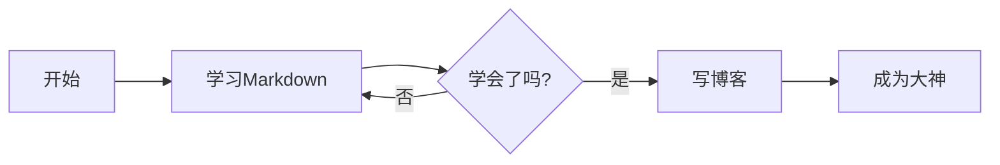

# Markdown语法完全指南：让你的文档优雅起来 ✨

> "人生苦短，我用Markdown。" —— 每一个厌倦了Word格式的程序员

## 前言：为什么要学Markdown？

还在为Word文档的格式问题抓狂吗？还在为富文本编辑器的各种诡异行为困扰吗？恭喜你，Markdown来拯救你了！

Markdown是一种轻量级标记语言，它让你用简单的符号就能写出格式优美的文档。最重要的是——**它的语法简单到你奶奶都能学会**（前提是你奶奶想学）。

---

## 一、标题：文档的灵魂 📝

在Markdown中，标题就像是给文字穿上了不同尺码的衣服。用`#`号表示标题，几个`#`就是几级标题。

```markdown
# 一级标题 - 最大号的老大
## 二级标题 - 二当家
### 三级标题 - 三把手
#### 四级标题 - 开始变小了
##### 五级标题 - 更小了
###### 六级标题 - 最小的，别再小了
```

**效果展示：**

# 一级标题 - 最大号的老大
## 二级标题 - 二当家
### 三级标题 - 三把手

⚠️ **注意**：`#`后面要跟一个空格，不然它就罢工了！

---

## 二、段落和换行：别让文字挤在一起 📄

### 段落

段落之间空一行就行了，简单吧？

```markdown
这是第一段。

这是第二段。
```

### 换行

如果你想在一段内换行（不是分段），有两种方法：
1. 在行尾敲两个空格，然后回车
2. 使用HTML的`<br>`标签（偷懒专用）

```markdown
第一行末尾有两个空格  
第二行紧跟着

或者用这个<br>也行
```

---

## 三、文字强调：让重点一眼就看到 💪

### 粗体

粗体就像是给文字吃了蛋白粉，用`**`或`__`包裹。

```markdown
**这是粗体**
__这也是粗体__
```

**效果**：**这就是粗体，壮！**

### 斜体

斜体就像是文字喝醉了，用`*`或`_`包裹。

```markdown
*这是斜体*
_这也是斜体_
```

**效果**：*这就是斜体，飘~*

### 粗斜体

又粗又斜，双重强调！用`***`或`___`。

```markdown
***既粗又斜***
___也是既粗又斜___
```

**效果**：***又壮又飘，完美！***

### 删除线

想表达"我说错了"？用`~~`包裹。

```markdown
~~这句话是错的~~
```

**效果**：~~这句话是错的~~

---

## 四、列表：让事情井井有条 📋

### 无序列表

用`-`、`+`或`*`开头，选一个你喜欢的就行。

```markdown
- 苹果
- 香蕉
- 橘子
  - 砂糖橘（缩进表示子列表）
  - 丑橘
```

**效果**：
- 苹果
- 香蕉
- 橘子
  - 砂糖橘
  - 丑橘

### 有序列表

用数字加点开头。有趣的是，你写的数字是什么其实不重要，Markdown会自动排序。

```markdown
1. 第一步
2. 第二步
3. 第三步
   1. 第三步的子步骤
   2. 还有一个
```

**效果**：
1. 第一步
2. 第二步
3. 第三步
   1. 第三步的子步骤
   2. 还有一个

### 任务列表

做项目管理必备！用`- [ ]`表示未完成，`- [x]`表示已完成。

```markdown
- [x] 学习Markdown
- [x] 写博客文章
- [ ] 成为Markdown大师
- [ ] 统治世界
```

**效果**：
- [x] 学习Markdown
- [x] 写博客文章
- [ ] 成为Markdown大师
- [ ] 统治世界

---

## 五、链接：通往互联网的传送门 🔗

### 行内链接

最常用的方式：`[链接文字](URL "可选的标题")`

```markdown
[百度一下](https://www.baidu.com "你就知道")
[GitHub](https://github.com)
```

**效果**：[百度一下](https://www.baidu.com "你就知道")

### 引用链接

当你要多次使用同一个链接时，这个方法很方便。

```markdown
这是[Google][1]和[GitHub][2]的链接。

[1]: https://www.google.com "搜索引擎"
[2]: https://github.com "程序员的家"
```

### 自动链接

直接写URL，用`<>`包裹。

```markdown
<https://www.example.com>
<example@email.com>
```

---

## 六、图片：一图胜千言 🖼️

图片语法和链接几乎一样，只是前面加个感叹号`!`。

```markdown


```

**小技巧**：图片描述（alt text）不仅对SEO有好处，当图片加载失败时也能让读者知道这里本来该是什么。

---

## 七、代码：程序员的最爱 💻

### 行内代码

用反引号`` ` ``包裹，适合在段落中插入代码。

```markdown
使用`console.log()`可以在控制台输出信息。
```

**效果**：使用`console.log()`可以在控制台输出信息。

### 代码块

用三个反引号``` 包裹，还可以指定语言来启用语法高亮。

````markdown
```javascript
function sayHello() {
  console.log("Hello, Markdown!");
}
```

```python
def say_hello():
    print("Hello, Markdown!")
```
````

**效果**：

```javascript
function sayHello() {
  console.log("Hello, Markdown!");
}
```

```python
def say_hello():
    print("Hello, Markdown!")
```

---

## 八、引用：站在巨人的肩膀上 💬

用`>`开头，可以嵌套。

```markdown
> 这是一条引用。
> 
> —— 某位智者

> 一级引用
>> 二级引用
>>> 三级引用（套娃警告！）
```

**效果**：

> 这是一条引用。
> 
> —— 某位智者

> 一级引用
>> 二级引用
>>> 三级引用

---

## 九、分隔线：文档的分界线 ➖

用三个或更多的`-`、`*`或`_`。

```markdown
---
***
___
```

**效果**：就是上面你看到的那些横线！

---

## 十、表格：数据的艺术 📊

表格可能是Markdown中最复杂的部分了（其实也不算复杂）。

```markdown
| 姓名 | 年龄 | 职业 |
|------|------|------|
| 张三 | 25   | 程序员 |
| 李四 | 30   | 设计师 |
| 王五 | 28   | 产品经理 |
```

**效果**：

| 姓名 | 年龄 | 职业 |
|------|------|------|
| 张三 | 25   | 程序员 |
| 李四 | 30   | 设计师 |
| 王五 | 28   | 产品经理 |

### 对齐方式

在分隔线上加冒号`:`可以控制对齐。

```markdown
| 左对齐 | 居中对齐 | 右对齐 |
|:-------|:--------:|-------:|
| 左     | 中       | 右     |
| Left   | Center   | Right  |
```

**效果**：

| 左对齐 | 居中对齐 | 右对齐 |
|:-------|:--------:|-------:|
| 左     | 中       | 右     |
| Left   | Center   | Right  |

---

## 十一、转义字符：当符号想做自己 🎭

如果你想显示Markdown的特殊符号本身，用反斜杠`\`转义。

```markdown
\*这不是斜体\*
\# 这不是标题
\[这不是链接\]
```

**效果**：\*这不是斜体\*

需要转义的字符：
```
\   反斜杠
`   反引号
*   星号
_   下划线
{}  花括号
[]  方括号
()  圆括号
#   井号
+   加号
-   减号
.   英文句点
!   感叹号
```

---

## 十二、脚注：学术范儿十足 📚

脚注让你的文章更专业（虽然不是所有Markdown解析器都支持）。

```markdown
这是一个需要脚注的句子[^1]。

[^1]: 这里是脚注的内容。
```

---

## 十三、HTML：终极武器 🔧

Markdown搞不定的时候，直接用HTML！是的，你可以在Markdown中直接写HTML。

```markdown
<div style="color: red;">
  这段文字是红色的！
</div>

<details>
<summary>点击展开</summary>
这是隐藏的内容。
</details>
```

---

## 十四、高级技巧：让你脱颖而出 🎯

### 1. Emoji

在支持的平台上，可以用`:emoji名称:`插入表情。

```markdown
:smile: :heart: :rocket: :fire:
```

😊 ❤️ 🚀 🔥

### 2. 数学公式（需要支持LaTeX）

行内公式：`$E=mc^2$`

块级公式：
```markdown
$$
\frac{-b \pm \sqrt{b^2-4ac}}{2a}
$$
```

### 3. 流程图和图表（需要Mermaid支持）



---

## 十五、常见错误和避坑指南 ⚠️

### 1. 忘记空格

❌ 错误：`#标题`（没有空格）  
✅ 正确：`# 标题`

### 2. 列表前不空行

```markdown
这是一段文字
- 列表项1  ← 可能不会被识别为列表
- 列表项2
```

正确做法：列表前后都空一行。

### 3. 代码块语言拼写错误

❌ 错误：` ```javascrip `  
✅ 正确：` ```javascript `

### 4. 混用标记符号

在一篇文档中，最好统一使用一种风格：
- 无序列表统一用`-`或`*`
- 粗体统一用`**`或`__`

---

## 十六、编辑器推荐 🛠️

### 在线编辑器
- **StackEdit** - 功能强大的在线Markdown编辑器
- **Dillinger** - 简洁美观
- **HackMD** - 支持多人协作

### 桌面编辑器
- **Typora** - 所见即所得，优雅至极（收费了，但值得）
- **Obsidian** - 笔记神器，支持双向链接
- **VS Code** - 配合插件使用，程序员最爱
- **Mark Text** - 免费开源，界面清爽

### 移动端
- **iA Writer** - iOS/Android，极简主义
- **Joplin** - 开源免费，支持同步

---

## 十七、实战演练 🎮

来，试着用Markdown写一份自我介绍吧！

```markdown
# 关于我

## 基本信息

- **姓名**：张三
- **职业**：全栈工程师
- **爱好**：代码、咖啡、猫

## 技能树

| 技能 | 熟练度 |
|------|--------|
| JavaScript | ⭐⭐⭐⭐⭐ |
| Python | ⭐⭐⭐⭐ |
| Markdown | ⭐⭐⭐⭐⭐ |

## 座右铭

> Talk is cheap, show me the code.
> 
> —— Linus Torvalds

## 联系方式

- GitHub: [github.com/zhangsan](https://github.com)
- Email: <zhangsan@example.com>
- 博客: [我的技术博客](https://blog.example.com)

---

*最后更新：2025-11-10*
```

---

## 结语：Markdown的哲学 🎓

Markdown的设计哲学是**"易读易写"**。它不追求复杂的排版效果，而是让你专注于内容本身。

记住：
- ✅ **内容大于形式** - 好的内容比花哨的格式重要
- ✅ **简单就是美** - 不要过度使用格式
- ✅ **一致性** - 保持文档风格统一
- ✅ **可读性** - Markdown源文件本身就应该易读

### 最后的建议

1. **多练习** - 熟能生巧，很快你就能盲打Markdown了
2. **查文档** - 不同平台的Markdown略有差异，遇到问题查对应的文档
3. **善用预览** - 写完记得预览，确保格式正确
4. **保持简洁** - 不要为了用Markdown而用Markdown

---

## 附录：速查表 📖

### 快速参考

| 效果 | 语法 | 示例 |
|------|------|------|
| 标题 | `# H1` ~ `###### H6` | `# 标题` |
| 粗体 | `**text**` | **粗体** |
| 斜体 | `*text*` | *斜体* |
| 删除线 | `~~text~~` | ~~删除~~ |
| 链接 | `[text](url)` | [链接](#) |
| 图片 | `` |  |
| 代码 | `` `code` `` | `code` |
| 引用 | `> quote` | > 引用 |
| 列表 | `- item` 或 `1. item` | - 列表 |

---

## 练习题 📝

想检验自己是否真正掌握了Markdown？试试这些练习：

**初级**
1. 创建一个有三级标题的文档
2. 写一个包含粗体、斜体和删除线的段落
3. 制作一个购物清单（无序列表）

**中级**
4. 创建一个任务清单，标记部分为已完成
5. 制作一个3行3列的表格
6. 在文档中插入一段代码，并指定语言

**高级**
7. 写一篇博客文章，包含所有学到的元素
8. 用嵌套列表制作一个目录结构
9. 制作一个包含代码示例、表格和图片的技术文档

---

## 相关资源 🔍

- [Markdown官方教程](https://www.markdownguide.org/)
- [GitHub Flavored Markdown](https://github.github.com/gfm/)
- [CommonMark规范](https://commonmark.org/)
- [Markdown速查表](https://www.markdownguide.org/cheat-sheet/)

---

好了，现在你已经掌握了Markdown的全部精髓（差不多了）！从今天开始，告别Word的格式困扰，拥抱Markdown的简洁优雅吧！

记住，最好的学习方法就是**实践**。打开你的编辑器，开始写吧！不管是笔记、博客还是文档，Markdown都能让你的文字更优雅。

**Happy Markdown-ing!** 🎉

---

*如果你觉得这篇文章有帮助，别忘了分享给其他还在Word里挣扎的朋友们！*

*本文使用Markdown编写，全程无Word伤害。*