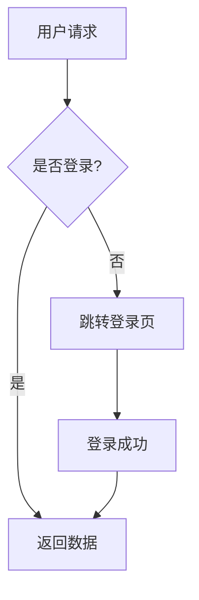
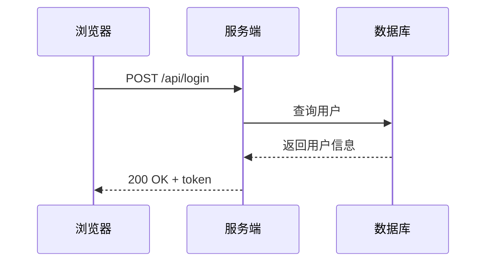
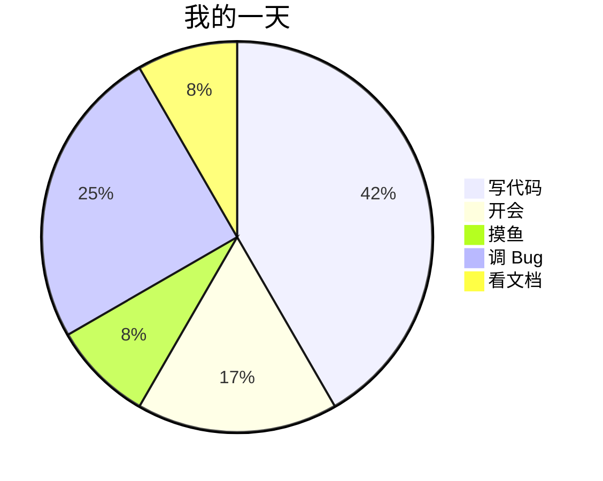

## 为什么要用代码画图

画图工具我用过不少，Visio、draw.io、ProcessOn……都挺好，但有个共同的痛点：**改起来太麻烦**。节点多了之后拖来拖去对齐半天，改个流程分支恨不得重画。

后来接触到 Mermaid，发现用文本描述图表这个思路意外地顺手——改结构就是改几行代码的事，版本管理直接丢 Git 里，不用存一堆 `.drawio` 文件。而 [Mermaid Live Editor](https://mermaid.live) 就是官方提供的在线编辑器，打开浏览器就能用，不装任何东西。

## Mermaid 简单介绍

Mermaid 是一个基于 JavaScript 的图表渲染库，核心理念是**用类 Markdown 的文本语法来定义图表**，然后由引擎渲染成 SVG。

它在 Markdown 生态里已经被广泛支持了：GitHub 的 Markdown 直接渲染 mermaid 代码块，Notion、Typora、Obsidian、GitLab 也都内置了支持。所以你学会 Mermaid 语法之后，很多地方都能直接用，不只是在 Live Editor 里。

## Mermaid Live Editor 能干什么

打开 [mermaid.live](https://mermaid.live)，界面很直观：左边是代码编辑区，右边是实时渲染的图表预览。你改一个字符，右边立刻更新。

### 支持的图表类型

能画的东西比想象中多：

- **流程图**（Flowchart）—— 最常用的，画业务流程、逻辑分支
- **时序图**（Sequence Diagram）—— 接口调用、消息传递
- **类图**（Class Diagram）—— 面向对象设计
- **状态图**（State Diagram）—— 状态机
- **ER 图**（Entity Relationship）—— 数据库表关系
- **甘特图**（Gantt）—— 项目排期
- **饼图**（Pie Chart）—— 简单的数据占比
- **Git 图**（Gitgraph）—— 分支合并可视化
- **思维导图**（Mindmap）—— 脑暴整理

### 导出和分享

画完图可以直接导出 SVG 或 PNG，质量很高，放文档里完全够用。

还有个很实用的功能：**URL 分享**。编辑器会把你的代码状态编码到 URL 里，把链接发给别人，对方打开就能看到你的图，还能继续编辑。协作的时候特别方便，不用来回传文件。

### 其他细节

- 可以切换不同的 Mermaid 版本（测试新语法或者排查兼容性问题）
- 支持多种主题：default、dark、forest、neutral
- 有语法错误会实时提示，不用猜哪里写错了

## 快速上手

直接上几个例子，复制到 [mermaid.live](https://mermaid.live) 就能看到效果。

### 流程图

语法很直觉：`-->` 表示箭头，`{}` 是菱形判断框，`[]` 是矩形，`|文字|` 是连线上的标注。

### 时序图

时序图用来画接口交互特别清晰，比在文档里用文字描述强太多。

### 饼图

## 实际使用场景

说几个我自己觉得好用的场景：

**写技术文档配图** —— 以前画个架构图要开 draw.io 折腾半天，现在直接在 Markdown 里写 mermaid 代码块，渲染出来就是图。改架构改代码就行，不用重新拖拽。

**技术方案评审** —— 评审的时候经常需要画流程说明调用链路，在 mermaid.live 里现场写几行就能出图，比打开 PPT 画箭头快多了。

**README 里嵌图** —— GitHub 原生支持 mermaid，直接在 README 里写代码块就能渲染，不用额外托管图片。

**和同事沟通** —— 把 mermaid.live 的链接甩过去，对方能直接看到图还能改，比截图来回传方便。

## 小结

Mermaid Live Editor 就是这么个工具：打开浏览器，写几行文本，出一张还不错的图。不花哨，但确实解决了"画图麻烦、改图更麻烦"的问题。如果你平时写文档、画流程图比较多，值得花十分钟熟悉一下语法。

官网地址：[https://mermaid.live](https://mermaid.live)