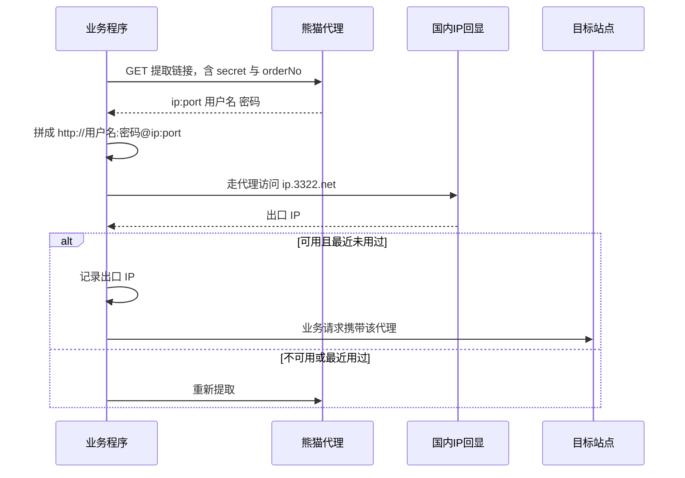

## 前言

熊猫代理（`xiongmaodaili.com`）是国内常见的 HTTP 代理 IP 服务商，按提取量或时长计费。它的接口风格和巨量HTTP 恰好相反：

- **不需要签名**，靠提取链接里的 `secret` 鉴权
- **账密认证，不依赖 IP 白名单**，所以本地、云主机、海外机器都能用
- 返回格式是空格分隔的 `ip:port 用户名 密码`

这也意味着它的对接代码可以写得很短——拿到链接、`GET`、解析一行文本就完事了。

- 官网：`https://www.xiongmaodaili.com`
- 提取路由：`http://route.xiongmaodaili.com`

> 本文只讲接口怎么调。文中出现的订单密钥、订单号、代理地址全部是占位符。

---

## 一、接口一览

熊猫代理对外主要就一个动作：**调用提取链接拿代理**。

| 接口 | 路径 | 用途 | 是否计费 |
|---|---|---|---|
| 提取代理 | `GET /xiongmao-web/api/glip` | 按订单提取 IP | 是 |

完整的提取链接形如：

```
http://route.xiongmaodaili.com/xiongmao-web/api/glip?secret=你的订单密钥&orderNo=你的订单号&count=1&isTxt=1&proxyType=1&returnAccount=2
```

链接在后台的 **「API下载」** 页面生成，生成时页面上可以勾选参数，也可以生成后自己改参数值。

---

## 二、提取链接参数详解

| 参数 | 必选 | 说明 |
|---|---|---|
| `secret` | 是 | 订单密钥，等同密码，鉴权用 |
| `orderNo` | 是 | 订单号 |
| `count` | 是 | 本次提取数量 |
| `isTxt` | 否 | `1` 返回纯文本，`0` 返回 JSON |
| `proxyType` | 否 | 代理协议：`1` HTTP(S)、`2` SOCKS5 |
| `returnAccount` | 否 | `2` 表示返回带账密的格式 |

其中 `isTxt=1` 配合 `returnAccount=2` 是最常用的组合，因为返回结果最容易解析：

```
1.2.3.4:5678 用户名 密码
5.6.7.8:5678 用户名 密码
```

一行一个代理，字段之间用空格分隔。

### 关于账密

**返回的账密是订单固定的**——它属于整个订单，而不是某一个 IP。也就是说，你用这个订单提取到的任意 `ip:port`，都可以配上同一组账密使用：

```
http://用户名:密码@1.2.3.4:5678
```

这一点和「一 IP 一账密」的动态账密模式不同，写代码时不用为每个 IP 单独保存凭据。

### 不需要签名，也不需要白名单

和巨量HTTP 对比一下就清楚了：

| 对比项 | 熊猫代理 | 巨量HTTP |
|---|---|---|
| 鉴权方式 | 提取链接里的 `secret` | 参数 MD5 签名，或后台生成的固定链接 |
| 代理鉴权 | 订单固定账密 | 动态账密 / 固定账密 / IP 白名单 |
| 是否需要配白名单 | 不需要 | `whitelist` 模式需要 |
| 返回格式 | `ip:port 用户名 密码` | `ip:port` 或 `ip:port:用户名:密码` |
| 适合部署环境 | 任意，含云主机与海外 | `whitelist` 模式仅限大陆 IP |

如果你的程序要部署在公网云主机上，熊猫代理这种账密认证的方式省事很多。

---

## 三、准备工作

### 1. 生成提取链接

1. 进入熊猫代理后台
2. 打开 **「API下载」** 页面
3. 选好订单、协议类型、返回格式，生成链接
4. 把生成的链接原样保存

### 2. 凭据存放

提取链接本身包含 `secret`，属于敏感信息，不要写进代码：

```json
// xiongmao_config.json —— 记得加进 .gitignore
{
  "api_link": "http://route.xiongmaodaili.com/xiongmao-web/api/glip?secret=你的订单密钥&orderNo=你的订单号&count=1&isTxt=1&proxyType=1&returnAccount=2",
  "enabled": true
}
```

也可以用环境变量：

```bash
export XMD_API_LINK="你的完整提取链接"
```

---

## 四、解析返回结果

返回纯文本时，解析逻辑很简单，但**必须先识别错误响应**：限频、余额不足、订单过期等情况平台会返回中文提示或 JSON 错误体，如果不判断，正则解析会失败并抛出一个看不懂的异常。

```python
import re


def extract(api_link: str, http) -> tuple:
    """调提取链接，解析一行 ip:port 用户名 密码。返回 (host, user, password)。"""
    r = http.get(api_link, timeout=30.0)
    text = r.text.strip()

    if not text:
        raise XiongmaoError(f"提取返回空（HTTP {r.status_code}）")
    # 平台限频 / 余额不足等会返回中文提示或 JSON 错误体
    if text.startswith("{") or "错误" in text or "频繁" in text or "余额" in text:
        raise XiongmaoError(f"提取失败: {text[:160]}")

    lines = [line.strip() for line in text.splitlines() if line.strip()]
    if not lines:
        raise XiongmaoError(f"提取返回无有效行: {text[:160]}")

    parts = re.split(r"\s+", lines[0])
    if len(parts) < 3 or ":" not in parts[0]:
        raise XiongmaoError(f"提取返回格式异常: {text[:160]}（需要 ip:port 用户名 密码）")

    host, user, password = parts[0], parts[1], parts[2]
    return host, user, password
```

用 `re.split(r"\s+", ...)` 而不是 `split(" ")`，可以兼容平台偶尔用多个空格或制表符分隔的情况。

拼成代理 URL：

```python
proxy = f"http://{user}:{password}@{host}"
```

---

## 五、验证代理是否真的可用

提取成功不代表能用。必须走一次代理请求，确认能连通并拿到出口 IP：

```python
import httpx

CHECK_URL = "https://ip.3322.net"


def check(proxy: str, test_url: str = CHECK_URL,
          timeout: float = 15.0) -> tuple:
    try:
        with httpx.Client(proxy=proxy, timeout=timeout) as c:
            r = c.get(test_url, headers={"User-Agent": "Mozilla/5.0"})
            r.raise_for_status()
            return True, r.text.strip()[:64]
    except Exception as e:
        return False, f"{type(e).__name__}: {e}"
```

**为什么用 `ip.3322.net`？** 它是纯文本的国内回显服务，返回的 IP 就是熊猫代理服务器看到的出口 IP。如果用海外回显服务（如 `api.ipify.org`），走国内住宅代理出口访问时容易超时或返回 5xx，会让你把「回显服务不可达」误判成「代理不可用」。

---

## 六、非消耗性预检

熊猫代理的提取是计费的，所以「凭据配好了没、网络通不通」这类检查最好不要靠提取来做。可以只探一下路由域名的连通性：

```python
def precheck(api_link: str, http) -> str:
    """非消耗性预检：不提取 IP，不消耗额度。"""
    if not api_link:
        raise XiongmaoError("缺少提取链接：请配置 api_link")
    try:
        # 只探路由域名连通性，不带 secret，不消耗提取次数
        http.get("http://route.xiongmaodaili.com", timeout=10.0)
    except Exception as e:
        raise XiongmaoError(f"提取通道不可达: {type(e).__name__}: {e}")
    return "提取通道正常"
```

注意这里请求的是**不带 `secret` 的裸域名**，所以不会消耗提取次数。

---

## 七、出口 IP 去重

同一订单反复提取时，平台很可能再次分配给你最近刚用过的出口 IP。如果这个出口此前因为某些操作被目标站点标记过，复用它会带来不必要的麻烦。

所以除了平台侧的过滤能力，本地也应该记一份「最近用过的出口 IP」并主动避开：

```python
import json
import os
import time

HISTORY_FILE = "used_exits.json"
FRESH_HOURS = 24.0


def load_history() -> dict:
    if os.path.exists(HISTORY_FILE):
        try:
            return json.load(open(HISTORY_FILE, encoding="utf-8"))
        except Exception:
            pass
    return {}


def recent_exits() -> set:
    """最近 24 小时内用过的出口 IP。"""
    cutoff = time.time() - FRESH_HOURS * 3600
    return {ip for ip, ts in load_history().items() if ts >= cutoff}


def mark_exit(exit_ip: str) -> None:
    hist = load_history()
    hist[exit_ip] = time.time()
    cutoff = time.time() - FRESH_HOURS * 3600
    hist = {ip: ts for ip, ts in hist.items() if ts >= cutoff}
    json.dump(hist, open(HISTORY_FILE, "w", encoding="utf-8"),
              ensure_ascii=False, indent=2)
```

把「提取 → 验证 → 记账」整段做成带锁的原子操作，多线程场景下才能保证不同任务拿到的出口 IP 互不相同：

```python
def get_fresh_proxy(client, max_tries: int = 6, log=print):
    """提取一个出口最近未用过的可用代理，返回 (代理URL, 出口IP)。"""
    seen = set()
    for i in range(1, max_tries + 1):
        host, user, password = client._extract()
        proxy = f"http://{user}:{password}@{host}"
        ok, info = client.check(proxy)
        if not ok:
            log(f"[代理] {host} 不可用（{info}），重新提取 ...")
            continue
        exit_ip = str(info).strip()
        if exit_ip in recent_exits() or exit_ip in seen:
            log(f"[代理] 出口 {exit_ip} 最近用过（第 {i} 次），避开重取 ...")
            seen.add(exit_ip)
            continue
        mark_exit(exit_ip)
        return proxy, exit_ip
    raise XiongmaoError(f"连续 {max_tries} 次未取到未用过的出口 IP")
```

---

## 八、完整流程



---

## 九、curl 示例

```bash
# 1. 提取一个代理（返回 ip:port 用户名 密码）
curl "http://route.xiongmaodaili.com/xiongmao-web/api/glip?secret=你的订单密钥&orderNo=你的订单号&count=1&isTxt=1&proxyType=1&returnAccount=2"

# 2. 提取 5 个
curl "http://route.xiongmaodaili.com/xiongmao-web/api/glip?secret=你的订单密钥&orderNo=你的订单号&count=5&isTxt=1&proxyType=1&returnAccount=2"

# 3. 非消耗性预检：只探通道，不带 secret
curl "http://route.xiongmaodaili.com"

# 4. 用提取到的代理验证出口 IP
curl -x "http://用户名:密码@1.2.3.4:5678" "https://ip.3322.net"
```

---

## 十、Python 完整示例

```python
# -*- coding: utf-8 -*-
"""熊猫代理最小可用客户端。"""
import json
import os
import re
import threading
import time

import httpx

CHECK_URL = "https://ip.3322.net"
CONFIG_FILE = "xiongmao_config.json"
HISTORY_FILE = "used_exits.json"
FRESH_HOURS = 24.0

_EXTRACT_LOCK = threading.RLock()


class XiongmaoError(Exception):
    pass


class XiongmaoClient:
    def __init__(self, config_file: str = CONFIG_FILE, timeout: float = 20.0):
        self.config_file = config_file
        cfg = {}
        if os.path.exists(config_file):
            try:
                cfg = json.load(open(config_file, encoding="utf-8"))
            except Exception:
                cfg = {}
        self.api_link = (cfg.get("api_link") or os.environ.get("XMD_API_LINK") or "").strip()
        self.enabled = bool(cfg.get("enabled", True))
        self.http = httpx.Client(timeout=timeout)

    # ---------- 提取 ----------
    def _extract(self) -> tuple:
        """调提取链接，解析一行 ip:port 用户名 密码。返回 (host, user, password)。"""
        if not self.api_link:
            raise XiongmaoError(
                "缺少提取链接：请在后台「API下载」生成链接后填入 xiongmao_config.json")
        with _EXTRACT_LOCK:
            try:
                r = self.http.get(self.api_link, timeout=30.0)
            except Exception as e:
                raise XiongmaoError(f"提取请求失败: {type(e).__name__}: {e}") from e

        text = r.text.strip()
        if not text:
            raise XiongmaoError(f"提取返回空（HTTP {r.status_code}）")
        # 平台限频 / 余额不足等会返回中文提示或 JSON 错误体
        if text.startswith("{") or "错误" in text or "频繁" in text or "余额" in text:
            raise XiongmaoError(f"提取失败: {text[:160]}")

        lines = [line.strip() for line in text.splitlines() if line.strip()]
        if not lines:
            raise XiongmaoError(f"提取返回无有效行: {text[:160]}")

        parts = re.split(r"\s+", lines[0])
        if len(parts) < 3 or ":" not in parts[0]:
            raise XiongmaoError(f"提取返回格式异常: {text[:160]}（需要 ip:port 用户名 密码）")

        host, user, password = parts[0], parts[1], parts[2]
        return host, user, password

    def precheck(self) -> str:
        """非消耗性预检：只探路由域名连通性，不提取 IP。"""
        if not self.api_link:
            raise XiongmaoError("缺少提取链接：请配置 api_link")
        try:
            self.http.get("http://route.xiongmaodaili.com", timeout=10.0)
        except Exception as e:
            raise XiongmaoError(f"提取通道不可达: {type(e).__name__}: {e}")
        return "熊猫代理提取通道正常"

    # ---------- 验证 ----------
    @staticmethod
    def check(proxy: str, test_url: str = CHECK_URL,
              timeout: float = 15.0) -> tuple:
        try:
            with httpx.Client(proxy=proxy, timeout=timeout) as c:
                r = c.get(test_url, headers={"User-Agent": "Mozilla/5.0"})
                r.raise_for_status()
                return True, r.text.strip()[:64]
        except Exception as e:
            return False, f"{type(e).__name__}: {e}"

    # ---------- 出口去重 ----------
    def _load_history(self) -> dict:
        with _EXTRACT_LOCK:
            if os.path.exists(HISTORY_FILE):
                try:
                    return json.load(open(HISTORY_FILE, encoding="utf-8"))
                except Exception:
                    pass
            return {}

    def recent_exits(self) -> set:
        cutoff = time.time() - FRESH_HOURS * 3600
        return {ip for ip, ts in self._load_history().items() if ts >= cutoff}

    def mark_exit(self, exit_ip: str) -> None:
        with _EXTRACT_LOCK:
            hist = self._load_history()
            hist[exit_ip] = time.time()
            cutoff = time.time() - FRESH_HOURS * 3600
            hist = {ip: ts for ip, ts in hist.items() if ts >= cutoff}
            json.dump(hist, open(HISTORY_FILE, "w", encoding="utf-8"),
                      ensure_ascii=False, indent=2)

    def get_fresh_proxy(self, max_tries: int = 6, log=print):
        """提取一个出口最近未用过的可用代理，返回 (代理URL, 出口IP)。

        整段持锁执行：并发任务各自拿到的出口 IP 必然不同。
        """
        with _EXTRACT_LOCK:
            seen = set()
            for i in range(1, max_tries + 1):
                host, user, password = self._extract()
                proxy = f"http://{user}:{password}@{host}"
                ok, info = self.check(proxy)
                if not ok:
                    log(f"[代理] {host} 不可用（{info}），重新提取 ...")
                    continue
                exit_ip = str(info).strip()
                if exit_ip in self.recent_exits() or exit_ip in seen:
                    log(f"[代理] 出口 {exit_ip} 最近用过（第 {i} 次），避开重取 ...")
                    seen.add(exit_ip)
                    continue
                self.mark_exit(exit_ip)
                return proxy, exit_ip
            raise XiongmaoError(f"连续 {max_tries} 次未取到未用过的出口 IP")


if __name__ == "__main__":
    xp = XiongmaoClient()
    print(xp.precheck())
    proxy, exit_ip = xp.get_fresh_proxy()
    print("代理出口:", exit_ip, "（账密认证）")
    print("代理地址:", proxy.split("@")[-1])
```

依赖：`pip install httpx`。

---

## 十一、常见错误与排查

| 现象 | 原因 | 处理 |
|---|---|---|
| 返回中文提示「请求过于频繁」 | 提取频率过高 | 降低提取频率，或复用已提取到的代理 |
| 返回余额/订单相关提示 | 订单过期或余额不足 | 到后台检查订单状态与余额 |
| 返回格式解析失败 | 返回了 JSON 错误体而不是文本 | 先判断错误响应再解析，不要直接正则 |
| 代理请求超时 | 该节点本身不可用 | 走 `ip.3322.net` 验证，不可用就换下一个 |
| 反复拿到同一个出口 IP | 平台再次分配了最近用过的出口 | 本地记录最近 24 小时出口并主动避开 |
| SOCKS5 端口连不上 | 链接里 `proxyType` 与客户端协议不匹配 | 确认 `proxyType`：`1` HTTP(S)、`2` SOCKS5 |

---

## 十二、安全与合规提示

- **提取链接不要进代码仓库**。链接里的 `secret` 等同于订单密码，泄露后别人可以直接消耗你的提取额度。走环境变量或本地配置文件，并加进 `.gitignore`。
- **不要在日志里打印完整链接**。排查问题时打印 `api_link.split("?")[0]` 这样的前缀即可，避免密钥进日志。
- **注意提取频率**。提取是计费接口，写重试循环时记得设上限，别让一个 bug 把额度刷光。
- **用途要合法**。代理 IP 应只用于合法场景，例如自有服务的多地域可用性测试、数据采集前确认目标站点的 robots 与条款允许、隐私保护。不得用于绕过他人平台的服务条款、攻击、欺诈或任何违法用途。使用者需自行承担合规责任。

---

## 参考

- 熊猫代理官网：`https://www.xiongmaodaili.com`
- 提取路由：`http://route.xiongmaodaili.com`
- 提取链接在后台「API下载」页面生成
